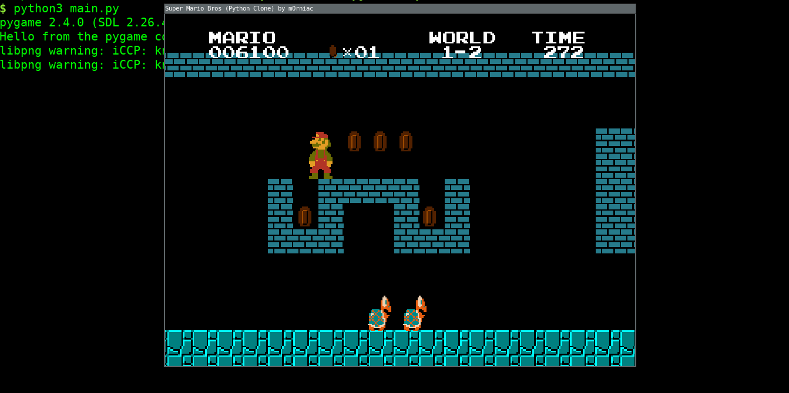

# Mario Platformer (Pygame)

A desktop side-scrolling platform game built with Python and Pygame, inspired by classic Mario gameplay. Choose Mario or Luigi, move through platform stages, collect coins and power-ups, avoid or defeat enemies, and reach the flagpole before time runs out.

This is an independent fan-made project, not an official Nintendo product.



## What you can do

- Choose Mario or Luigi from the main menu.
- Run, jump, crouch, and navigate platforms and pipes.
- Collect coins and power-ups, including mushrooms and the Fire Flower.
- Avoid or defeat enemies such as Goombas and Koopas.
- Track your score, coins, remaining lives, and level timer as you play.
- Finish a stage by reaching its flagpole; the game also includes game-over and timeout screens.

## Controls

| Key | Action |
|---|---|
| Left / Right arrows | Move |
| Space | Jump |
| Down arrow | Crouch or enter a pipe when available |
| S | Run; shoot a fireball when using the Fire Flower |
| Enter | Confirm the main-menu selection |

## Run the game

Python 3 and Pygame are required. The project pins Pygame in `requirements.txt`.

Run these commands from the `mario-upgrade--main` directory so the game can find its asset folders:

```bash
python -m venv .venv
```

Activate the environment, then install dependencies and launch the game:

```powershell
.venv\Scripts\Activate.ps1
python -m pip install -r requirements.txt
python main.py
```

On macOS or Linux, activate the environment with:

```bash
source .venv/bin/activate
```

## Project layout

```text
main.py                 Application entry point
source/main.py          Game state setup and launch
source/states/          Main menu, level, and transition screens
source/components/      Player, enemies, power-ups, blocks, and HUD
source/data/            Player and level data
resources/graphics/     Sprite and background assets
resources/demo/         Level preview images
images/                 README screenshots
requirements.txt        Python dependencies
```

## Author and license

Created by Tushar Saini 79. For questions or collaboration, visit the [author's LinkedIn profile](https://www.linkedin.com/in/tushar-saini-83791723b/). See [LICENSE](LICENSE) for the project's license terms.
